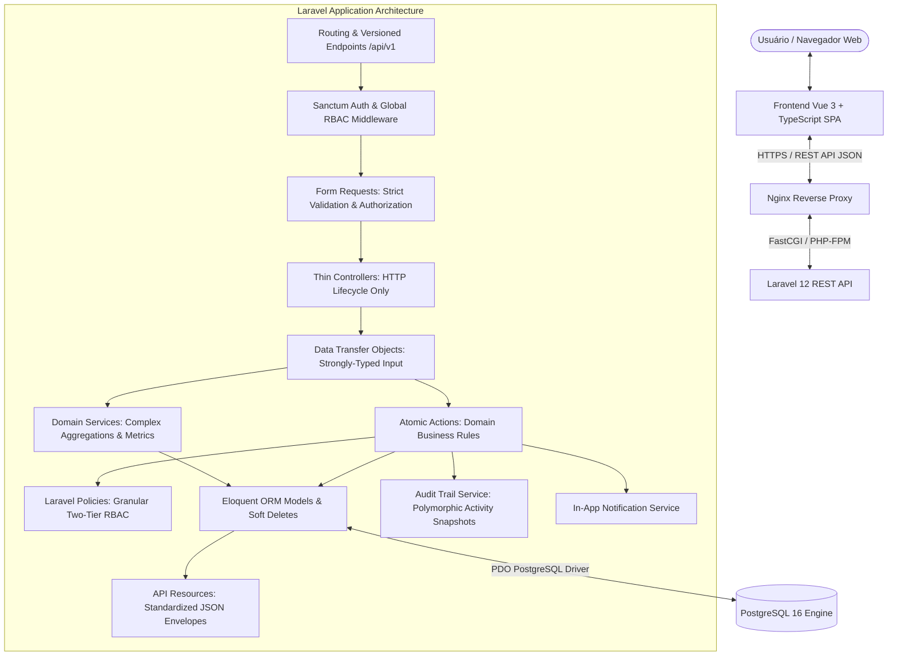

# Arquitetura de Software — TaskFlow

## 1. Visão Geral

O **TaskFlow** adota uma arquitetura em camadas orientada a casos de uso atômicos (**Action/Service-Driven Architecture**), inspirada em princípios de *Clean Architecture* e *Domain-Driven Design* (DDD). O objetivo primordial é o isolamento rigoroso entre a camada de apresentação visual, as regras de negócio de domínio e a camada de persistência.

---

## 2. Camadas da Aplicação

### 2.1 Frontend SPA (Vue 3 + TypeScript)
* **Single Page Application (SPA):** Inicializada com Vite 8, provendo compilação instantânea e empacotamento modular.
* **Component Architecture:** Interface modular utilizando Vue 3 Composition API com a sintaxe `<script setup lang="ts">`.
* **Gerenciamento de Estado (Pinia):** Stores centralizadas e fortemente tipadas para gerenciar a sessão do usuário autenticado (`authStore`) e notificações em tempo real.
* **Roteamento Seguro (Vue Router 4):** Definição de rotas versionadas com *Navigation Guards* automatizados para validação de tokens Sanctum e papéis de acesso antes de renderizar qualquer visualização restrita.
* **Design System (Tailwind CSS 3.4):** Paleta moderna em modo escuro (*Dark Mode* nativo), efeitos visuais sofisticados (*glassmorphism*, micro-transições, indicadores pulsantes) e responsividade fluida para desktops e dispositivos móveis.
* **Optimistic UI:** O quadro Kanban adota atualizações otimistas na interface gráfica com *rollback* automático caso o servidor reporte indisponibilidade ou falha de validação.

### 2.2 Camada de Apresentação e Roteamento (Backend API)
* **Endpoints Versionados:** Todas as rotas públicas e autenticadas são isoladas sob o prefixo `/api/v1`, viabilizando evolução e compatibilidade retroativa.
* **Controladores Finos (*Thin Controllers*):**
  * Responsabilidade única de receber requisições HTTP, delegar a execução para DTOs/Actions e retornar envelopes formatados.
  * Proibição de regras de negócio, queries diretas ou operações de persistência dentro de controladores.
* **Envelopes Uniformes de Resposta:** Todas as respostas da API seguem um formato determinístico:
  * **Sucesso:** `{ "success": true, "data": ..., "message": "..." }`
  * **Falha/Validação:** `{ "success": false, "message": "...", "errors": { ... } }`

### 2.3 Camada de Validação e DTOs
* **Form Requests Estritos:** Validações declarativas que interceptam requisições antes que qualquer lógica de domínio seja instanciada. Utilizam regras tipadas (`Rule::enum`, `exists`, `min`, `max`).
* **Data Transfer Objects (DTOs):** Classes tipadas *readonly* que transformam arrays associativos de requisições em estruturas de dados fortemente tipadas e imutáveis.

### 2.4 Camada de Domínio e Regras de Negócio
* **Actions Atômicas:** Classes de propósito único contendo a lógica central de cada caso de uso (`CreateTaskAction`, `UpdateTaskStatusAction`, `ReorderTasksAction`, `CreateProjectAction`).
* **Transações Atômicas:** Operações que alteram múltiplas entidades ou envolvem auditoria e notificações são envelopadas em `DB::transaction` para garantia total de integridade ACID.
* **Services Agregadores:** Serviços especializados para tarefas multidimensionais, como `DashboardMetricsService` (cálculo de KPIs com escopo de permissão) e `GlobalSearchService` (busca unificada em projetos, tarefas e usuários).

### 2.5 Camada de Autorização (RBAC de Dois Níveis)
* **Políticas Granulares (*Policies*):** Classes de autorização vinculadas a cada modelo (`ProjectPolicy`, `TaskPolicy`, `UserPolicy`, `CommentPolicy`).
* **Bypass de Administrador Global:** Usuários com perfil `admin` possuem auditoria e acesso total em toda a plataforma.
* **Escopo Contextual por Projeto:** Usuários comuns só podem visualizar projetos e tarefas caso sejam membros da equipe. Apenas papéis autorizados (`OWNER`, `MANAGER`, `MEMBER`) podem alterar status e movimentar itens no quadro Kanban.

### 2.6 Camada de Persistência e Auditoria
* **PostgreSQL 16:** Utilização de tipos nativos, constraints de chave estrangeira com integridade referencial estrita e índices compostos.
* **Soft Deletes:** Preservação de dados históricos para auditoria sem exclusão física imediata nas tabelas `users`, `projects`, `tasks` e `comments`.
* **Trilha de Auditoria Polimórfica:** Registro automático de modificações sensíveis com snapshots do estado anterior (`old_values`) e estado posterior (`new_values`) em formato JSONB.

---

## 3. Padrões de Projeto (Design Patterns) Adotados

| Padrão | Onde é Aplicado | Benefício Técnico |
|---|---|---|
| **Action Pattern** | `app/Actions/*` | Alta coesão, testabilidade isolada e reaproveitamento de casos de uso. |
| **Data Transfer Object (DTO)** | `app/DTOs/*` | Eliminação de tipagem fraca e arrays mutáveis em trânsito. |
| **API Resource Envelope** | `app/Http/Resources/*` | Desacoplamento entre esquema do banco e contratos públicos da API. |
| **Policy / Gate RBAC** | `app/Policies/*` | Centralização das regras de autorização fora dos controladores. |
| **Observer / Audit Trail** | `app/Services/AuditLogService` | Rastreabilidade completa de ações sem poluir a lógica de negócio. |
| **Optimistic UI with Rollback** | `frontend/src/components/kanban` | UX instantânea sem latência perceptível, com garantia de consistência. |
| **Spotlight Command Palette** | `frontend/src/components/common/GlobalSearchModal` | Produtividade acelerada via busca global com atalhos de teclado (`Ctrl+K`). |
