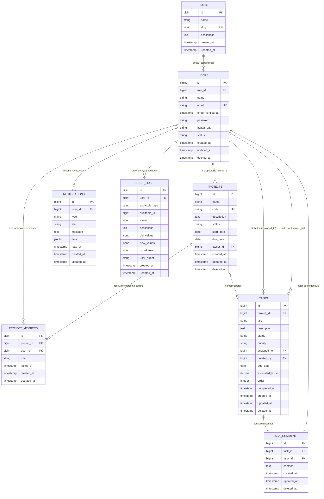

# Arquitetura de Dados & Esquema PostgreSQL — TaskFlow

O banco de dados do **TaskFlow** foi projetado para alta confiabilidade, integridade referencial estrita e auditoria granular sobre o motor **PostgreSQL 16**.

---

## 1. Diagrama Entidade-Relacionamento (ERD)

---

## 2. Dicionário de Dados das Tabelas

### 2.1 `roles` (Perfis Globais do Sistema)
Armazena os perfis fixos de governança do sistema (`admin`, `manager`, `user`).
* `id`: Chave primária (Big Serial).
* `name`: Rótulo de exibição legível (ex: "Administrador").
* `slug`: Identificador único programático (`admin`, `manager`, `user`).
* `description`: Descrição do propósito do perfil.

### 2.2 `users` (Contas de Acesso)
* `id`: Chave primária.
* `role_id`: FK referenciando `roles(id)`.
* `name`: Nome completo do usuário.
* `email`: Endereço único utilizado no login.
* `password`: Hash Bcrypt da senha.
* `status`: Enum (`ACTIVE`, `INACTIVE`).
* `deleted_at`: Timestamp para exclusão lógica (*Soft Delete*).

### 2.3 `projects` (Projetos Gerenciados)
* `id`: Chave primária.
* `name`: Nome do projeto.
* `code`: Código alfanumérico identificador único (ex: `PRJ-ALPHA`).
* `status`: Enum (`PLANNING`, `ACTIVE`, `ON_HOLD`, `COMPLETED`, `ARCHIVED`).
* `owner_id`: FK referenciando o usuário criador/proprietário (`users(id)`).
* `start_date` / `due_date`: Metas temporais de execução.

### 2.4 `project_members` (Associação e Papel na Equipe)
* `project_id`: FK referenciando `projects(id)` com `ON DELETE CASCADE`.
* `user_id`: FK referenciando `users(id)` com `ON DELETE CASCADE`.
* `role`: Enum contextual (`OWNER`, `MANAGER`, `MEMBER`, `VIEWER`).
* **Constraint:** Índice Único composto em `(project_id, user_id)`.

### 2.5 `tasks` (Demandas & Quadro Kanban)
* `id`: Chave primária.
* `project_id`: FK referenciando `projects(id)`.
* `title`: Título conciso da tarefa.
* `description`: Detalhamento em formato texto ou markdown.
* `status`: Enum (`todo`, `in_progress`, `review`, `done`).
* `priority`: Enum (`low`, `medium`, `high`, `urgent`).
* `assigned_to`: FK anulável referenciando o membro executor (`users(id)`).
* `created_by`: FK referenciando o criador (`users(id)`).
* `due_date`: Data estipulada para entrega.
* `order`: Inteiro para posicionamento e ordenação sequencial dentro das colunas do Kanban.
* `completed_at`: Data e hora exata da conclusão (definida automaticamente quando `status = done`).

### 2.6 `task_comments` (Histórico de Discussão)
* `task_id`: FK referenciando `tasks(id)` com `ON DELETE CASCADE`.
* `user_id`: FK referenciando o autor (`users(id)`).
* `content`: Conteúdo textual do comentário.

### 2.7 `notifications` (Notificações Internas In-App)
* `user_id`: FK referenciando o destinatário (`users(id)`).
* `type`: Tipo do evento (ex: `task_assigned`, `task_status_changed`, `comment_added`).
* `title` / `message`: Conteúdo descritivo.
* `data`: Payload estruturado em `jsonb` contendo referências de rota.
* `read_at`: Anulável; preenchido quando o usuário consome a notificação.

### 2.8 `audit_logs` (Trilha de Auditoria Polimórfica)
* `user_id`: Usuário autor da ação auditada.
* `auditable_type`: Classe do modelo auditado (`App\Models\Project`, `App\Models\Task`, etc.).
* `auditable_id`: ID do registro modificado.
* `event`: Identificador do evento (`created`, `updated`, `status_changed`, `deleted`).
* `old_values` / `new_values`: Snapshots em formato `jsonb` das colunas modificadas.

---

## 3. Otimizações de Índices e Performance

* **Índices Compostos de Consulta de Tarefas:**
  * `tasks(project_id, status)`: Acelera o particionamento das colunas do quadro Kanban.
  * `tasks(assigned_to, status)`: Acelera filtros da visão "Minhas Demandas".
* **Índices de Prazos e Ordenação:**
  * `tasks(due_date)`: Otimiza cálculos de demandas atrasadas no dashboard.
  * `tasks(project_id, order)`: Otimiza a renderização rápida por ordem do Kanban.
* **Índices Polimórficos de Auditoria:**
  * `audit_logs(auditable_type, auditable_id)`: Acelera a recuperação do histórico de auditoria de itens específicos.
* **Índices Parciais de Notificações:**
  * `notifications(user_id, read_at)`: Consulta instantânea do contador de notificações não lidas no cabeçalho (*Navbar badge*).
